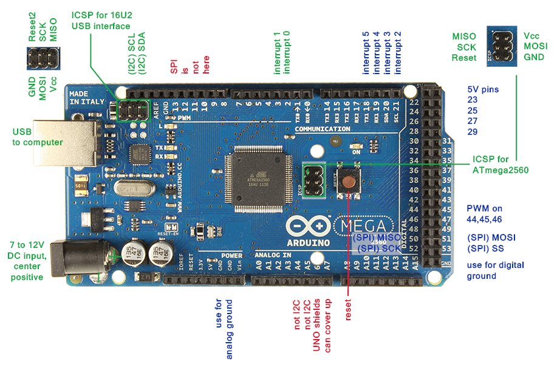

# sun_sensor
keithley and inclinometer automated (thermistor to be added)

Upload the inclinometer_thermistor sketch to the arduino and make connections by referring the images included below:

g  

make a virtual environment as per requirements.txt and run the sun_main.py code
